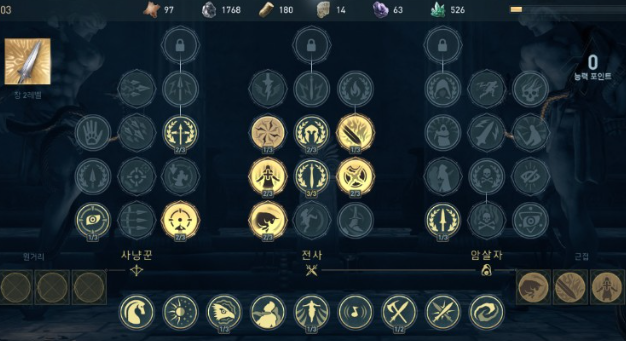

<b>게임 제목</b>

계몽

<b>기획 의도</b>

보스 몬스터와의 전투를 선호하는 사람들을 위해 오로지 보스전만 존재하는 게임을 기획.  
 
(사진은 보스전을 위주로 플레이하는 Steam의 Titan Soul) 
단 탐험요소를 완전히 배제하지는 않음. 보스 : 탐험 = 7 : 3 정도.

<b>콘셉트</b>

사계절의 각 특징을 가지고 있는 지역들로 나뉘어진 판타지 대륙. 
각 대륙은 계절에 맞는 특징을 가지고 있음. 
플레이어는 각 대륙을 지나면서 대륙의 세력, 계절의 수호자들과 싸우며 성장해나감. 
봄 : 숲과 암석지대, 사냥꾼 집단  |  여름 : 사막지대, 모험가 집단  |  가을 : 평지(곡창지대?), 무사 집단  |  겨울 : 얼음계곡, 마법사 집단

<b>소재 및 장르</b>

어드벤처 + RPG + 탑다운

<b>주요 플랫폼</b>(시스템 사양)

미정이 딸이에요

<b>이용대상자</b>(주요 소비층)

'엘든링', '타이탄 소울' 같은 보스전 위주의 게임을 좋아하는 플레이어들.

<b>게임의 특징</b>(차별점, 주요 재미요소)

보스를 잡고 그 보스의 특징이 담긴 능력을 얻는 방법을 통해 성장을 하는 요소가 존재. 
각 대륙의 보스를 잡으면 그 지역과 관련된 힘을 얻을 수 있다. 
또한 맵 곳곳에 퍼즐, 숨겨진 길 등을 넣어서 탐험적인 요소들이 존재함.

<b>세계관 및 줄거리 설정</b>

네 개의 계절로 나뉜 판타지 대륙에서 각 계절의 수호자들이 불균형에 빠져 폭주. 
각 대륙의 집단들은 서로를 범인으로 생각해 서로를 적대중임. 
플레이어는 계절마다 해당 지역을 여행하며 적대 관계를 해소하고 오염을 정화, 최종적으로 이 모든 것을 조작하는 문성필과 싸움.

<b>주요 캐릭터 및 배경 설정</b>

플레이어는 대륙 바깥에서 온 존재이며, 각 대륙을 탐험하면서 의뢰나 부탁을 받아 계절의 불균형을 해소해주는 역할.

<b>게임 기본 구성</b>

메인화면 씬과 인게임 씬으로 구성. 

메인화면 씬 :  
Play, Load, Option, Quit 버튼이 존재. 각각 새로시작, 이어하기, 옵션, 나가기 버튼  
옵션에서는 게임의 소리, 화면 밝기 등을 바꿀 수 있다.

인게임 씬 :  
플레이어는 wasd키로 움직이고, 스페이스바로 구르고, 마우스 좌클릭으로 공격을 함. 
기본적으로 왼쪽상단에 플레이어의 체력과 스태미너가 존재. 체력은 말 그대로 체력이고 스태미너는 구르기를 사용할때 이용됨. 
k키를 누르면 보스몹들과의 싸움에서 얻은 힘을 적용할 수 있는 창이 뜸. 

또한 인게임에서 esc를 누르면 시스템창이 나오고 이어하기, 옵션, 나가기 버튼이 존재. 단 시간이 멈추지는 않음.

<b>콘텐츠 구성</b>(콘텐츠 순환구조도, 콘텐츠의 종류)

콘텐츠 순환 구조도 : 탐험, 퍼즐, 및 집단과의 싸움 → 해결 이후 의뢰 → 보스 발견 및 전투 준비 → 보스 전투 → 능력 흡수 및 성장 → 다음 지역으로 이동 
콘텐츠의 종류 :  
탐험 요소: 각 계절 지역마다 숨겨진 길, 보물, 특수 퍼즐 존재. 
전투 요소: 각 보스는 계절에 따른 고유한 특성과 패턴을 가지고 있으며, 이를 공략하는 것이 핵심 재미 요소. 
성장 요소: 보스를 처치할 때마다 플레이어가 새로운 능력을 얻고, 이를 스킬 트리로 강화 가능.

<b>맵구성</b>

거대한 대륙이 봄, 여름, 가을, 겨울의 특징을 가진 4대륙으로 나뉨. 
각각의 대륙은 계절의 순서대로만 이동할 수 있고(봄 → 여름 → 가을 → 겨울 → 봄의 순서대로만 이동가능),  
각 대륙의 끝자락에는 인접 대륙의 특징이 담긴 지형이 살짝씩 보임.(봄, 여름 사이를 예로 들면 봄 대륙에서는 바닥에 깔린 모래들이 보이고, 여름 대륙에서는 풀들이 서서히 보임) 

-------image

<b>게임진행</b>

게임 시작시 플레이어는 바다 위 나룻배에 탄 상태로 시작한다. 이후 봄의 대륙과 맞닿은 해안가에 안착한다(해안가+숲이 섞인 느낌의 장소).  
-------imgae 
대륙을 이리저리 돌아다니다가 봄의 대륙의 사냥꾼 집단이 사는 마을에 접근함.(겨울의 대륙 사이에는 빙하산맥이 존재해서 막히게 설계) 
-------image 
현재 각 대륙끼리 사이가 안좋기 때문에 외지인을 배척하는 사냥꾼 집단과 전투가 발생함. 
전투 이후 오해를 풀고 사냥꾼 집단은 플레이어에게 계절의 수호자의 오염을 정화시켜 달라고 의뢰를 줌. 이후 수호자와 전투 진행  
여름, 가을, 겨울 모두 이러한 느낌으로 진행. 단 각 대륙에서 발생하는 첫 전투는 전부 다른 느낌으로 진행. 집단별로 성향이 다르기 때문에 모든 집단이 외부인을 배척하지는 않기 때문. 
여름의 경우 사막에 사는 개미지옥같은 느낌의 몬스터와 전투, 가을의 경우 ...., 겨울의 경우 마법사 집단이 설치해놓은 마법함정(ex. 눈사태)을 돌파하는 방식으로 진행.  
